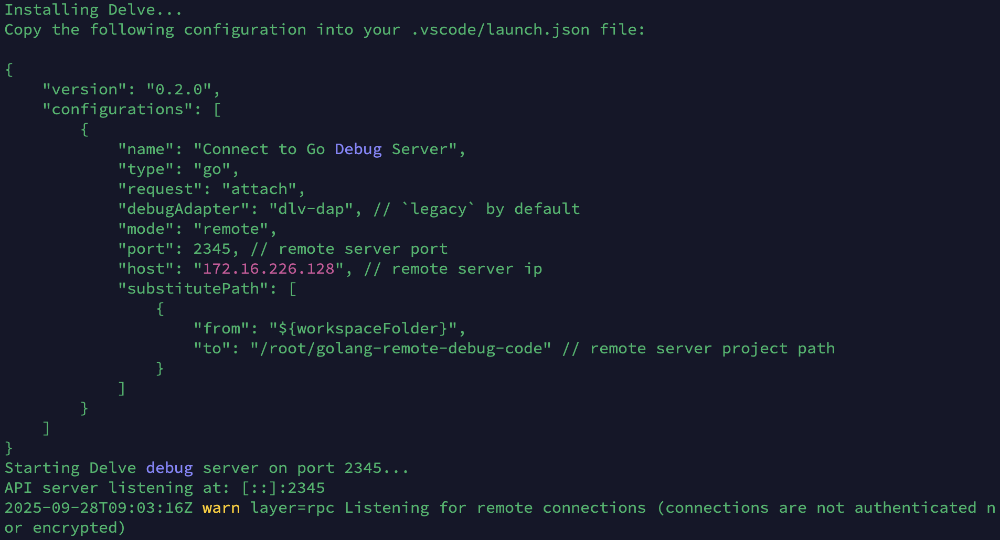
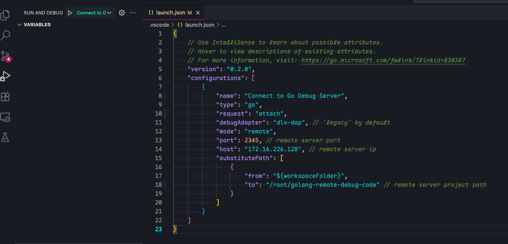
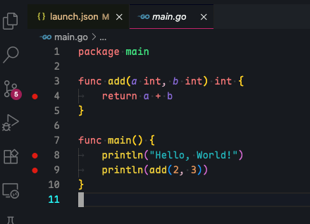
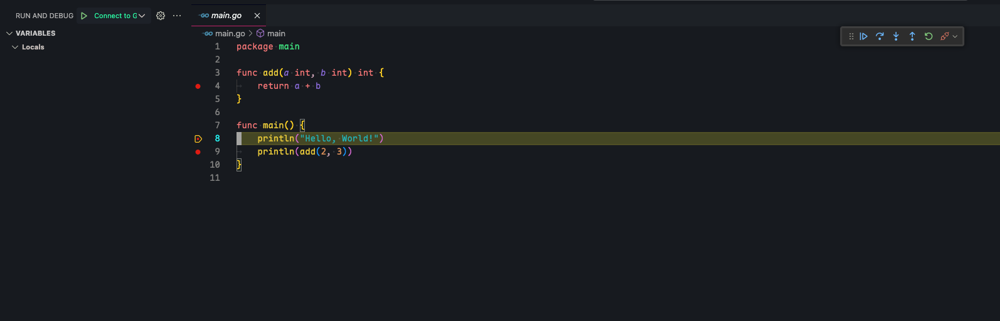

## remote

```
git clone https://github.com/fengqi-dev/golang-remote-debug-code.git
cd golang-remote-debug-code
bash run-debug-server.sh
```

You will got like this



## local

```
git clone https://github.com/fengqi-dev/golang-remote-debug-code.git
cd golang-remote-debug-code
```

Add `remote` gen to .vscode/launch.json



Add some breakpoint



Press F5 to debug

